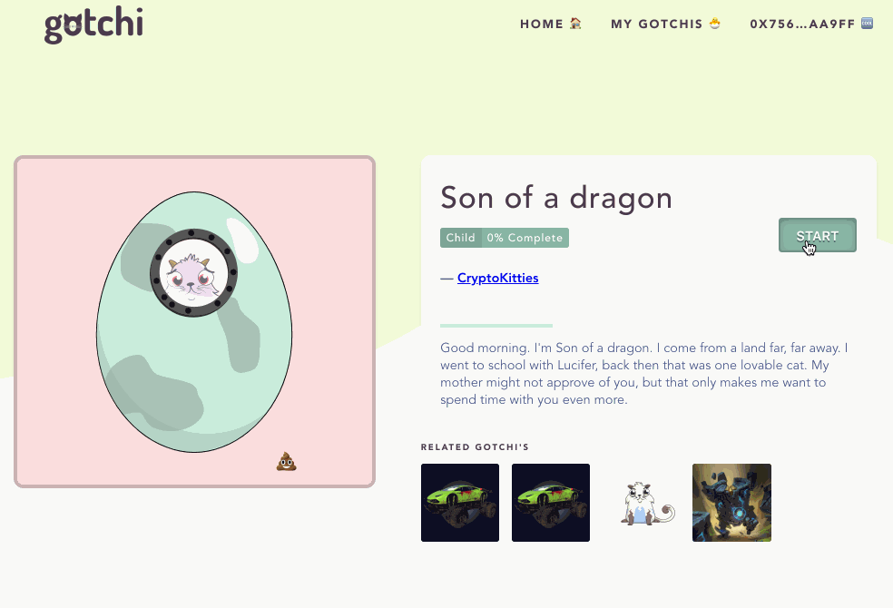

# Gotchi 🥚 🐣 😸

Crypto-collectible tamagotchi. Need I say more?
Remember those handheld tamagotchi toys from a decade ago? Yes, this is exactly the same idea, however the smart contract is built to interact with ERC721 collectibles, primarily [cryptokitties](https://www.cryptokitties.co/).

## Can you keep your Gotchi alive?!

#### Rules:
Rules are secret, keep your crypto-collectible alive.

#### Hints:

* Don't overfeed your gotchi
* Don't neglect your gotchi
* Don't let your gotchi misbehave
* Don't let your gotchi get lazy

#### BONUS
If your gotchi survives and becomes immortal *(YES, Immortal!)*, you will get an Ether reward from the pool of fees. Good luck!

###### NOTE:
This project is a submission for the Consensys Academy 2018.
All code represented is aimed to be a clear proof of concept.

## Documentation for Class Rubric:
- [Project Grading Checklist](/docs/project_checklist.md)
- [Gameplay Walkthrough](/docs/walkthrough.md)
- [Design Pattern Decisions](/docs/design_pattern_decisions.md)
- [Avoiding Common Attacks](/docs/avoiding_common_attacks.md)

## Start Development & Testing Locally

1. Clone the repo and run `npm install`
2. Open a new tab/window in terminal: start `ganache-cli`
3. `truffle test` - Test all contracts are working 100%
4. Re-start `ganache-cli`, copy a private key, import into MetaMask
5. Change MetaMask to `localhost:8545`
6. In a new tab/window of terminal, run `npm run dev` (this will open a browser tab!)
7. You should see a list of testing gotchis, please proceed to test the rest of the process using the [Gameplay Walkthrough Docs](/docs/walkthrough.md)

The repo development is mainly in `/contracts`, `/src` and `/test`.

#### To run local development website:
`npm run dev`
Open the server link printed in cli if it doesnt auto-load in a browser.

#### Helpful Commands
- `npm run build` - Builds compiled client deployable package
- `npm test` - Runs all tests
- `truffle compile` - Test contracts are compiling and have no errors
- `truffle migrate` - Compile and deploy contracts to local blockchain
- `truffle migrate --network rinkeby` - Compile and deploy contracts to network
- `truffle migrate -f 2 --network rinkeby` - Compile and deploy contracts to network without Migrations.sol
