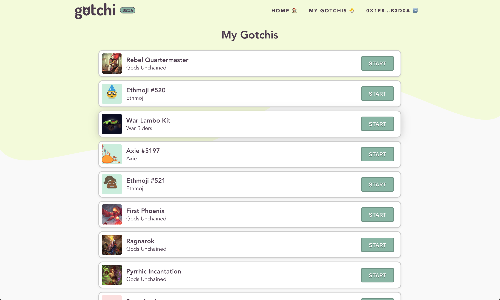
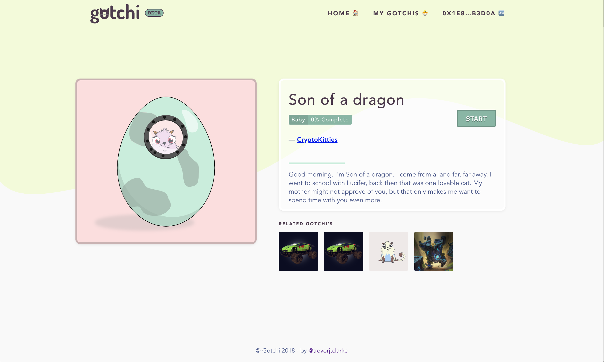

# Gotchi - Gameplay Walkthrough

## Homepage

## Step 1: Select A Gotchi

## Step 2: View Gotchi

## Step 3: Start Gotchi Gameplay with MetaMask

## Step 4: Wait for Confirmation on Blockchain

## Step 5: Gotchi Hatched! Blockchain Confirmation Complete

## Step 6: Feed Gotchi

## Step 7: Sleep Gotchi

## Step 8: Play Games with Gotchi

## Step 9: Gotchi Level Up!

## Step 10: Save Updates to Gotchi with MetaMask

## Step 11: Gotchi Updates Confirmed on Blockchain

## Step 12: View Other Gotchi's being played

